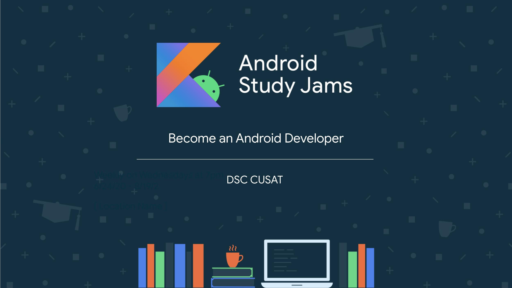

# Android Study Jams Resources
Resources, links, recorded sessions and solutions from Android Study Jams program by DSC CUSAT.

## Links
[The Course](https://g.co/android/studyjams)  
[Codelabs](codelabs.developers.google.com)
[Official Android Documentation](developer.android.com)   
[Github Repository with Code and Previous session links](https://github.com/DSCCUSAT/Android-Study-Jams-Resources)   
[Download Android Studio](developer.android.com/studio)  
[Kotlin Playground](play.kotlinlang.org)  
[Kotlin Koans](play.kotlinlang.org/koans/overview)

## Sessions and references

### Session 1 - Kotlin Introduction, Koans and Android Studio (28/11/20)
- [Slides](https://docs.google.com/presentation/d/1OPBYkuMV2E_xey0hvmBe08-eGWSsWlh-ZzQxk7TP6Io/edit?usp=sharing)
- [Event Link](https://dsc.community.dev/events/details/developer-student-clubs-cochin-university-of-science-and-technology-presents-android-study-jams/#/)
- [Recording of event (Upcoming)]()

### Session 2 - Android basics, Activities, Views, ViewGroups, Dice Roller app. (03/12/20)
- [Slides](https://docs.google.com/presentation/d/1PC7EZQMV5Pv6MATj1lU4LY7HXUaQ61YBA-qdifzo1m8/edit?usp=sharing)
- [Event Link](https://dsc.community.dev/events/details/developer-student-clubs-cochin-university-of-science-and-technology-presents-android-study-jams-ii/#/)
- [Recording of event (Upcoming)]()
  
## FAQ
- **What is the event about?**  
    Android Study Jams is a program hosted by Google DSC platform all around the world. This program is aimed to help you kick start your Android development career using Kotlin.
- **What are the benefits?**  
    * Learn to make Android Apps with Kotlin.
    * Meet people with same interests.
    * Get badges in your Google Developers profile.
    * Certificate after completion of course.
    * Chance of getting your app featured by Google on their social media.
    * Get Ready for Google's Solution Challenge 2021
- **Is it Kotlin only of has Flutter/Java?**  
    This program is focussed on Native Android development on Kotlin only.
- **What are the sessions about?**  
    The first few sessions would be the basics of Kotlin and Android and then we'll be building an app like on stream. This would be more practical and everyone learns faster.
- **How Long is the program?**  
    This program lasts multiple sessions on the Saturdays throughout december.
- **Do I need to know Kotlin beforehand?**  
    No, Basic knowledge of programming and other programming languages would be enough.
- **What are tasks needed to complete the course?**  
    * Finish Prior programming track of the course [here](https://g.co/android/studyjams) before the ending the course.
    * Share Screenshot of all the badges in your Google Developers profile to show you've completed the course.
    * Share the final working app assignment (Including the APK and screenshots) after the ending of the course.
- **I have problems with the code, help**  
    The best skill of a programmer is the skill of self learning and finding solutions to problems themselves. Try googling your issue and checking StackOverFlow for solutions. If you're still stuck, feel free to message me through any of the ways from the contact section below.
- **I missed a session, am I going to fall behind?**  
    Nope, I will add links to the recording here so you can watch it later on during your free time and digest it in your pace. 
- **I already know Android development, show I join the sessions?**  
    You can skip the first few introductory sessions if you want, and come in later for the more advanced sessions but completing the tasks mentioned above is necessary. You may also learn something new :)

## Contact
- [Linkedin](https://www.linkedin.com/in/cybershark/)
- [Website](https://sarath.is-a.dev/)

